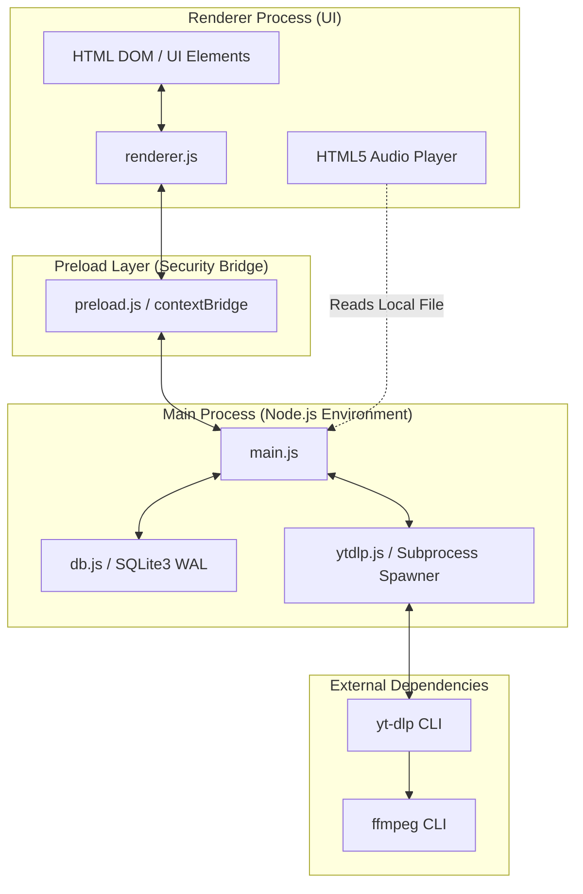
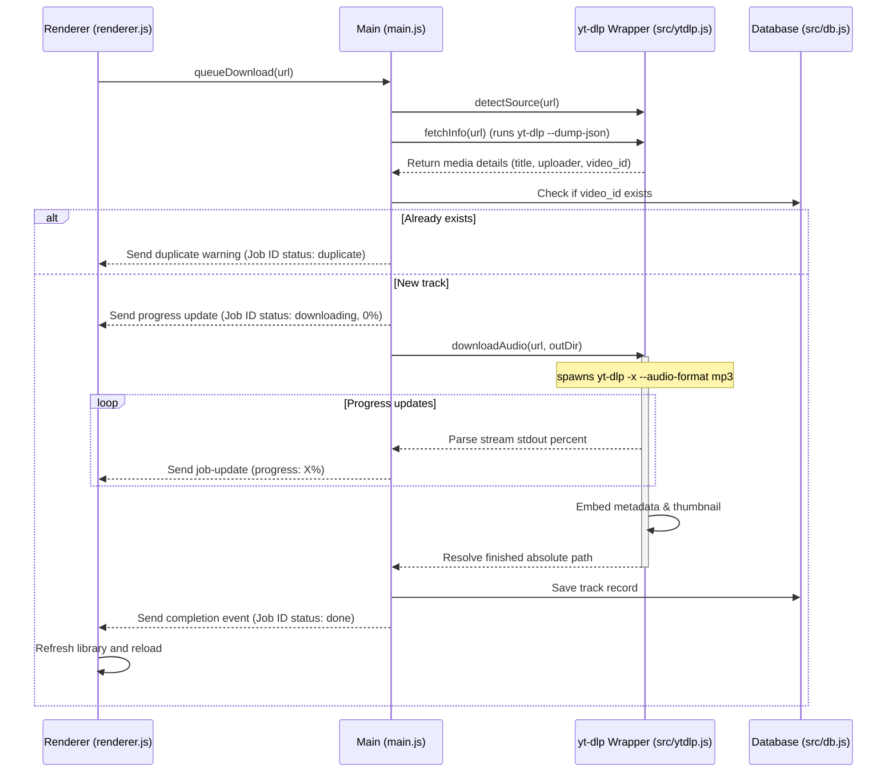

# Current — Architecture Documentation

This document provides a detailed overview of the system architecture, design patterns, data flow, and components of the **Current** desktop application.

---

## 1. System Design Overview

Current is built on the **Electron** framework, providing a cross-platform desktop wrapper with deep integration into macOS-specific aesthetics. It is designed to download, library-manage, and play audio from external streaming sources (YouTube, YouTube Music, and SoundCloud).

---

## 2. Process Model & Secu``rity Boundary

Electron isolates high-risk operations (such as running shell processes or editing files) from the UI layer. Current strictly adheres to Electron security best practices:

1. **Context Isolation & Preload Bridge**: The Renderer runs with `contextIsolation: true` and `nodeIntegration: false`. It cannot access Node.js APIs directly. Instead, `preload.js` exposes a secure, minimized bridge (`window.current`) using `contextBridge.exposeInMainWorld`.
2. **IPC Communication**: All interactions between the UI and the system (fetching tracks, starting downloads, updating metadata, deleting files) are dispatched as IPC queries (`ipcRenderer.invoke` $\to$ `ipcMain.handle`).
3. **No Direct Local File Exposure**: The UI does not access raw disk paths; rather, when local files are played, the HTML5 Audio element points to the file path handled by standard system file serving or direct path references exposed under validation.

---

## 3. Database Architecture (SQLite)

The application uses **better-sqlite3** to manage metadata. SQLite runs in Write-Ahead Log (WAL) mode to guarantee transactional safety and high-performance concurrent reads/writes.

### Schema: `tracks` Table

| Field | Type | Attributes | Description |
| :--- | :--- | :--- | :--- |
| `id` | `INTEGER` | `PRIMARY KEY AUTOINCREMENT` | Internal database row ID |
| `video_id` | `TEXT` | `UNIQUE` | Unique media provider ID (used to prevent duplicate downloads) |
| `source` | `TEXT` | `NOT NULL` | Media origin platform: `youtube`, `youtube-music`, `soundcloud` |
| `title` | `TEXT` | `NOT NULL` | Track title |
| `artist` | `TEXT` | | Artist or creator name |
| `uploader` | `TEXT` | | Channel or profile name of uploader |
| `duration` | `INTEGER` | | Track duration in seconds |
| `filepath` | `TEXT` | `NOT NULL` | Absolute local path to the downloaded `.mp3` |
| `thumbnail` | `TEXT` | | URL to the remote thumbnail artwork |
| `url` | `TEXT` | | Original media page URL |
| `tags` | `TEXT` | `NOT NULL DEFAULT ''` | Comma-separated user tags |
| `color` | `TEXT` | `NOT NULL DEFAULT 'none'` | Visual color marker tag (`none`, `red`, `orange`, `yellow`, etc.) |
| `added_at` | `INTEGER` | `NOT NULL` | Epoch timestamp of download completion |

### Indexing
- `idx_tracks_source` on `source`: Boosts filtering by platform source in the library tab.
- `idx_tracks_video_id` on `video_id`: Accelerates duplicate checking before downloading.

---

## 4. Media Processing Pipeline

The media ingestion pipeline consists of metadata extraction, audio extraction, transcoding, and post-processing.

### Path Resolution on macOS
Because macOS GUI apps launched from the Dock/Finder do not inherit standard user shell environment variables (`PATH`), the application includes a fallback resolver (`resolveBin` in `src/ytdlp.js`) that checks:
1. `/opt/homebrew/bin/` (Apple Silicon Macs)
2. `/usr/local/bin/` (Intel Macs)
3. Standard fallback path lookups

This prevents runtime errors such as `spawn yt-dlp ENOENT` during typical consumer installations.

---

## 5. UI & Presentation Layer

The user interface uses **Vanilla HTML5, Javascript, and CSS** with a custom design system styled for macOS.

Key styling and UI strategies:
- **Glassmorphism**: Backdrop blur filters (`backdrop-filter: blur(20px)`) combined with semi-transparent background colors (`rgba`) match the macOS visual styling.
- **Mac Vibrancy**: Native Electron window options (`vibrancy: 'sidebar'`, `titleBarStyle: 'hiddenInset'`) blend the application background dynamically with the user's desktop wallpaper.
- **Responsive Layout**: Designed with flexible grid and flexbox configurations to ensure usability at minimum sizes (520px width) up to full screen.
- **Micro-animations**: Transition states for hover styles, search result entry animations, and download progress bar shimmers.
