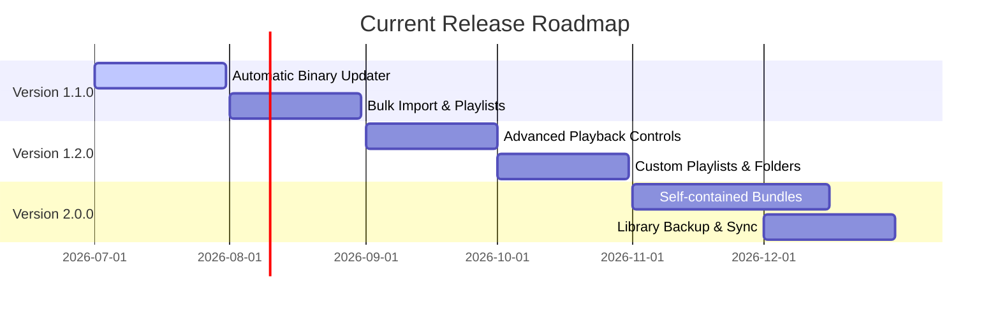

# Current — Project Roadmap

This document outlines the planned future features, performance enhancements, and architectural upgrades for the **Current** desktop application.

---

## 🗺️ Project Milestones

---

## 📦 Version 1.1.0 — Ingestion & Library Enhancements (Target: Q3 2026)

Focus: Improving the core downloading experience, handling media playlists, and automating dependency management.

- [ ] **Automatic yt-dlp Updates**
  * Check for yt-dlp upgrades on startup.
  * Implement in-app updates for self-contained binaries to prevent breakage when YouTube/SoundCloud APIs change.
- [ ] **Playlist & Album Downloads**
  * Support pasting playlist URLs (YouTube Playlists, SoundCloud Sets).
  * Show a batch download interface with queue prioritization.
- [ ] **Enhanced Metadata Tagging**
  * Support auto-tagging genre, album artwork, and release year.
  * Allow manual editing of Track Title and Artist (in addition to Tags and Colors) from the UI.
- [ ] **Duplicate Action Prompt**
  * Instead of automatically skipping duplicate video IDs, ask the user if they want to:
    1. Skip downloading
    2. Overwrite the existing file
    3. Keep both files

---

## 🎵 Version 1.2.0 — Audio Playback & Organization (Target: Q4 2026)

Focus: Elevating the built-in player into a robust daily-driver audio player.

- [ ] **Custom Playlist Creation**
  * Allow grouping tracks in the local library into user-defined playlists (stored in SQLite database).
- [ ] **Advanced Playback Features**
  * Add shuffle, repeat-one, and repeat-all modes.
  * Integrate macOS system Media Keys (Play/Pause, Next, Previous) using Electron's `globalShortcut` or `systemPreferences` media APIs.
  * Display a scrubbable timeline slider with time elapsed and time remaining.
- [ ] **Smart Filters & Playlists**
  * Create smart lists (e.g., "Recently Added", "Favorites", "Color Marked").
- [ ] **Audio Equalizer & Visualizer**
  * Add a basic 5-band Web Audio API equalizer.
  * Include a modern visualizer component in the playback bar.

---

## 🚀 Version 2.0.0 — Advanced Integration & Standalone App (Target: Q1 2027)

Focus: Zero-configuration installs, cross-device sync, and visual overhauls.

- [ ] **Zero-Dependency Bundle (Universal macOS App)**
  * Fully bundle custom pre-compiled builds of `ffmpeg` and `yt-dlp` in the final `.dmg` to eliminate the requirement for Homebrew.
  * Deliver unified builds supporting both Apple Silicon (`arm64`) and Intel (`x64`) architectures.
- [ ] **Library Syncing & Backups**
  * Export/import library metadata database and audio files.
  * Add options to sync to cloud storage services (e.g., iCloud Drive, Dropbox).
- [ ] **Visual Customization**
  * Light mode support matching native macOS appearance.
  * Glassmorphism transparency intensity configurations (adjust blur radius and color overlay opacity).
- [ ] **Mini-player mode**
  * A compact widget view that floats above other windows showing track metadata, album art, and controls.
