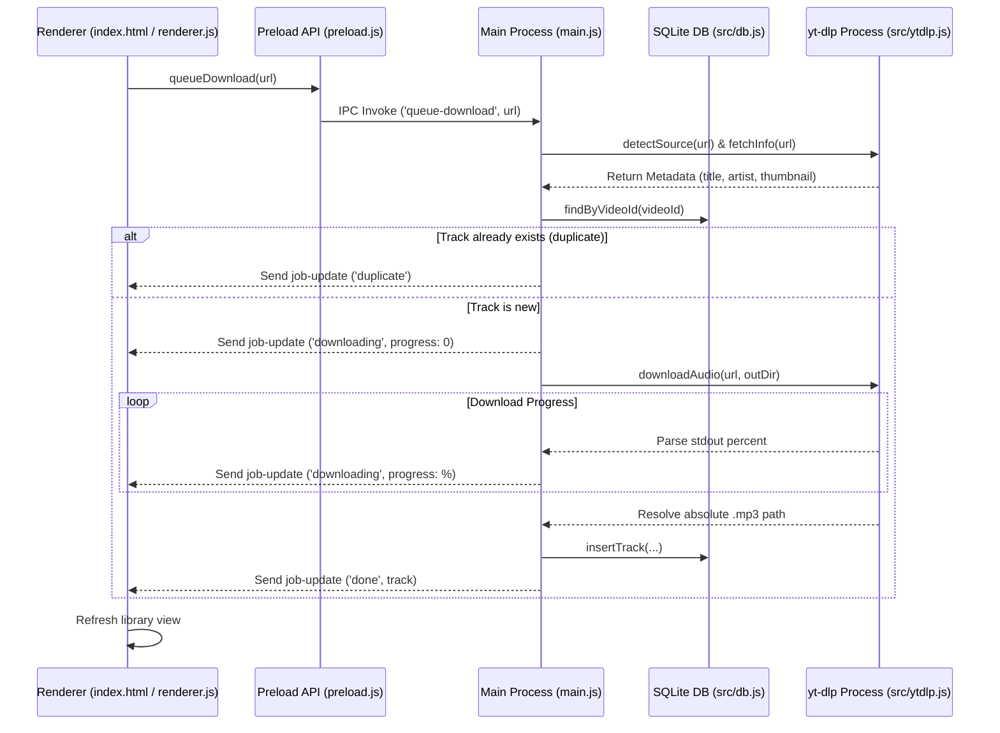

# Current — Project Structure & Architecture

This document describes the directory structure, file roles, and the overall system architecture of the **Current** Electron application.

---

## 1. Directory Layout

The project structure is organized as follows:

```text
current-desktop/
├── package.json          # Node.js manifest with Electron & electron-builder configurations
├── main.js               # Electron main process (lifecycle, IPC handlers, background downloads)
├── preload.js            # Preload script (safe bridge between main process and renderer)
├── .gitignore            # Git ignore list
├── release.sh            # Release build helper script
│
├── src/                  # Node-specific modules (run in Main process context)
│   ├── db.js             # SQLite database layer (better-sqlite3 helper functions)
│   └── ytdlp.js          # Spawn wrapper for yt-dlp command-line tool
│
└── renderer/             # Web assets (run in Renderer process context)
    ├── index.html        # App UI layout structure
    ├── style.css         # Modern macOS liquid-glass UI stylesheet
    └── renderer.js       # UI interaction logic, playback controls, and IPC listener
```

---

## 2. Core Architecture & Data Flow

The application splits its logic between the **Main Process** (full system/Node.js access) and the **Renderer Process** (isolated UI/DOM).



---

## 3. Component Details

### Main Process & Bridge
- **[main.js](file:///Users/di/Downloads/current-desktop/main.js)**: Configures the browser window (using macOS-native options like `titleBarStyle: 'hiddenInset'` and `vibrancy: 'sidebar'`), initializes the SQLite database, establishes folder paths, and exposes IPC handles for file management, downloads, and search.
- **[preload.js](file:///Users/di/Downloads/current-desktop/preload.js)**: Uses `contextBridge` to expose select IPC calls (`queueDownload`, `getTracks`, `setTags`, `deleteTrack`, `revealInFinder`, etc.) safely under `window.current`.

### Backend Modules (Main Context)
- **[src/db.js](file:///Users/di/Downloads/current-desktop/src/db.js)**: Configures a `better-sqlite3` instance in the user's application data directory using Write-Ahead Logging (WAL) for safety and performance. Performs indexing, searches, insertions, updates, and removals of track tags and files.
- **[src/ytdlp.js](file:///Users/di/Downloads/current-desktop/src/ytdlp.js)**: Resolves paths to `yt-dlp` and `ffmpeg` (handling macOS GUI app environment path variances by looking in Homebrew installation targets `/opt/homebrew/bin` and `/usr/local/bin`). Wraps download operations inside `child_process.spawn` to capture metadata and report progress percentage.

### Frontend (Renderer Context)
- **[renderer/index.html](file:///Users/di/Downloads/current-desktop/renderer/index.html)**: Builds a clean container layout containing the composer/input bar, the downloading queue, a tabbed library panel (All / YouTube / YT Music / SoundCloud), and a sticky bottom playback bar.
- **[renderer/renderer.js](file:///Users/di/Downloads/current-desktop/renderer/renderer.js)**: Handles form submissions, binds tabs, implements live search debouncing, renders visual download states, and hooks up the DOM `<audio>` element with custom title info.
- **[renderer/style.css](file:///Users/di/Downloads/current-desktop/renderer/style.css)**: Implements visual styling matching premium desktop designs, using glassmorphism borders (`backdrop-filter: blur`), custom HSL color accents, high-contrast typography, and smooth shimmer animations for active downloads.

---

## 4. SQLite Database Schema

The database uses a single main table: `tracks` with the following columns:

| Column Name | SQLite Type | Constraints | Purpose |
| :--- | :--- | :--- | :--- |
| `id` | `INTEGER` | `PRIMARY KEY AUTOINCREMENT` | Auto-incrementing identifier. |
| `video_id` | `TEXT` | `UNIQUE` | Unique video hash to prevent duplicate downloads. |
| `source` | `TEXT` | `NOT NULL` | The audio source provider (`youtube`, `youtube-music`, or `soundcloud`). |
| `title` | `TEXT` | `NOT NULL` | The title of the track. |
| `artist` | `TEXT` | | The track artist name. |
| `uploader` | `TEXT` | | The uploader profile or channel name. |
| `duration` | `INTEGER` | | Track duration in seconds. |
| `filepath` | `TEXT` | `NOT NULL` | The local system destination path of the `.mp3` file. |
| `thumbnail` | `TEXT` | | HTTP URL to the original thumbnail image. |
| `url` | `TEXT` | | Original media page URL. |
| `tags` | `TEXT` | `NOT NULL DEFAULT ''` | Comma-separated user-defined tags. |
| `added_at` | `INTEGER` | `NOT NULL` | Date/time stamp (Epoch ms) of entry insertion. |

**Indexes defined:**
- `idx_tracks_source` on `tracks(source)`
- `idx_tracks_video_id` on `tracks(video_id)`
